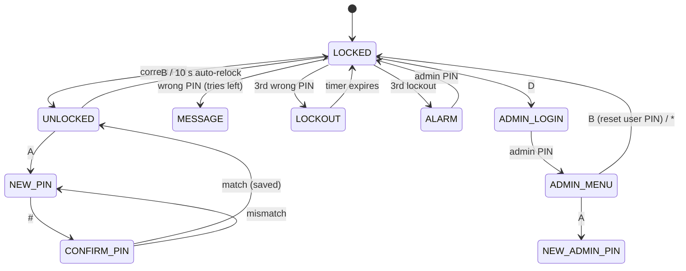

# 03 · Electronic Security System

A keypad access-control system with an LCD, a servo "bolt", a buzzer and status LEDs. It is written as an explicit **state machine**, and security behaviours like escalating lockouts and a latched alarm are part of the design rather than added afterwards.

## Features

- Masked PIN entry (`****`), backspace, clear, and an inactivity timeout that wipes partly typed PINs
- Servo bolt that **detaches after moving**, so the SG90 doesn't hum or keep drawing current
- **Auto-relock** 10 s after unlocking
- **Failed-attempt counter:** 3 wrong PINs → lockout. Lockouts double (30 s → 60 s), and the 3rd lockout raises the **alarm**
- **Latched alarm:** siren + flashing red LED. Only the **admin PIN** clears it, and it's stored in EEPROM so **pulling the power doesn't clear it**
- Rebooting after failed attempts also restarts the lockout, so a power cycle can't be used to skip the wait
- **Change user PIN** (new + confirm) while unlocked
- **Admin menu:** change the admin PIN, or reset the user PIN
- PINs are compared in **constant time**, so response timing doesn't leak how many digits were right
- Keypad scanning is written from scratch (no library), so you can see how a matrix keypad works

## State diagram

## Parts

| Qty | Part |
|---|---|
| 1 | 4×4 membrane keypad |
| 1 | LCD1602 |
| 1 | SG90 servo |
| 1 | Passive buzzer |
| 1 + 1 | Green LED, red LED + 220 Ω each |
| 1 + 1 | 220 Ω (backlight), 1 kΩ (contrast) |

## Wiring

| Arduino | Connects to |
|---|---|
| D9, D8, D7, D6 | Keypad pins 1–4 (rows) |
| D5, D4, D3, D2 | Keypad pins 5–8 (columns) |
| A0, A1 | LCD RS, E |
| A2, A3, A4, A5 | LCD D4, D5, D6, D7 (analogue pins work fine as digital outputs) |
| – | LCD RW → GND, V0 → 1 kΩ → GND, A → 220 Ω → 5V, K → GND |
| D10 | Servo signal (orange). Red → 5V, brown → GND |
| D11 | Passive buzzer (+) |
| D12 / D13 | Green / red LED → 220 Ω → GND |

With the keypad face up and the ribbon at the bottom, pin 1 is on the left. If the keys come out scrambled, reverse the order of `ROW_PINS`/`COL_PINS` in the sketch rather than rewiring.

> 💡 If the Arduino resets when the servo moves, the servo is pulling the USB 5 V down. Power the servo from the kit's breadboard power-supply module, and connect its GND to Arduino GND.

## Using it

| Key | Action |
|---|---|
| 0–9 | Enter digits |
| `#` | Enter / confirm |
| `*` | Clear entry (exit the admin menu) |
| `C` | Backspace |
| `A` | *(unlocked)* change user PIN |
| `B` | *(unlocked)* lock now |
| `D` | *(locked)* admin login |

**Defaults: user `1234`, admin `9999`.** Change both on first use. The Serial Monitor (115200) logs every event with a timestamp and never prints PINs.

To wipe everything back to factory defaults, change `SETTINGS_MAGIC` in the sketch and upload again.

## Tests to run and record

| # | Test | Expected |
|---|---|---|
| 1 | Enter 1234 # | Green LED, servo to 90°, relocks after 10 s |
| 2 | Wrong PIN ×2 | "2 tries left", "1 try left" |
| 3 | Wrong PIN ×3 | 30 s lockout countdown, keys ignored |
| 4 | Power-cycle during lockout | Comes back in lockout |
| 5 | Two more lockouts | Alarm. Power-cycle → still alarm. Admin PIN clears it |
| 6 | Change PIN, mistype the confirmation | "PINs differ", back to new PIN entry |
| 7 | Type 3 digits then wait 10 s | Entry cleared |

## Things to discuss in a write-up

- **Why a state machine?** Every key means something different depending on the state. Writing that as nested `if`s quickly becomes unreadable and buggy.
- **Threat model:** brute force (~10⁴ combinations for 4 digits) against lockout timing. How long would an attacker need, on average, with 3 tries per 30/60 s lockout followed by an alarm?
- **EEPROM wear:** about 100k write cycles per cell. `EEPROM.put()` only rewrites bytes that changed, and settings are only saved on events.
- **Weaknesses** you'd fix in a real product: PINs stored in plain text (hash them), the keypad wires are exposed, and an attacker could simply power the servo directly.

## Ideas to extend it

- Door-open sensor (tilt switch or reed switch) → alarm if the door opens while locked (needs an I²C LCD backpack to free up pins)
- RFID card + PIN two-factor (RC522 module)
- Event log in EEPROM with timestamps from a DS1307 RTC
- Store a salted hash of the PIN instead of the PIN itself
